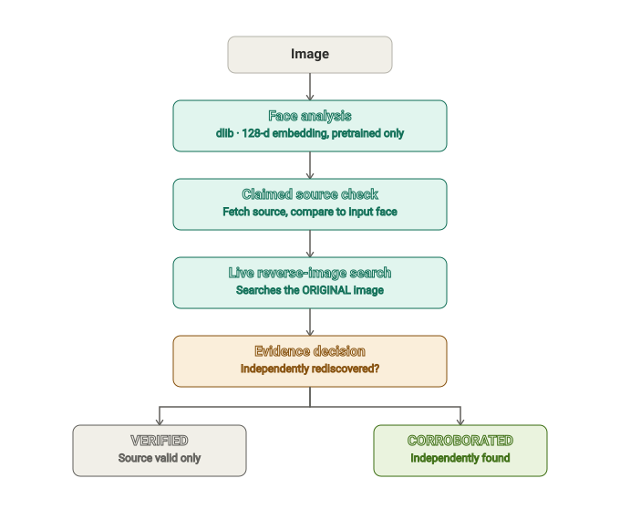
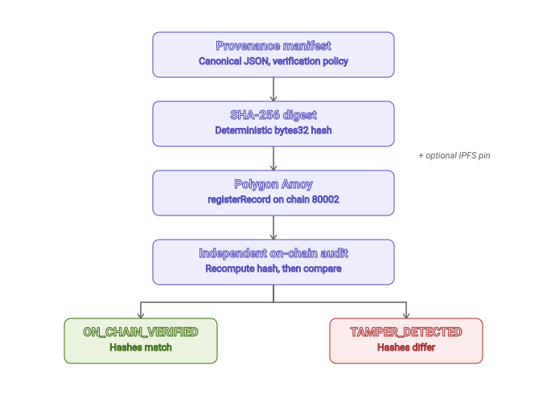

# TRACE

### THE WEB LEAVES TRACES.

**TRACE** is a public-media provenance and verification system. Give it
an image and it performs a genuine live reverse-image search, discovers
publicly accessible social-media sources, validates the visual
correspondence, builds a deterministic cryptographic provenance record,
anchors that record on Polygon Amoy, and independently re-verifies the
on-chain commitment.

`Python 3.11` &nbsp;·&nbsp; `face_recognition / dlib` &nbsp;·&nbsp; `SerpApi Google Lens` &nbsp;·&nbsp; `web3.py` &nbsp;·&nbsp; `Solidity ^0.8.24` &nbsp;·&nbsp; `Polygon Amoy (80002)` &nbsp;·&nbsp; `FastAPI`

Built for Hacker House Goa 2026, Task 3. CLI-first, with a local API
adapter for an optional UI layer. No public deployment.

---

## What TRACE is not

To be precise about scope, since this matters for a system that touches
faces and blockchains: TRACE is not a proof-of-identity system, not a
"100% match" claim, not a surveillance tool, and it does not search
"the entire internet" — it searches whatever a live reverse-image
search provider has indexed. Every status this system reports —
`VERIFIED`, `CORROBORATED`, `NO_MATCH` — is a statement about evidence
it actually collected, not a claim about a person's real-world identity.

---

## Current real project state

Everything below reflects what the repository actually does right now,
confirmed by running it — not a target state.

- **Image-only discovery** (`discover`) and **claimed-source
  verification** (`register`) are both implemented and have been run
  for real against live SerpApi results.
- A real `discover` → `register --dry-run` pass has reached
  `CORROBORATED` (see the example run below).
- **The real on-chain registration has deliberately not been executed
  yet.** The contract is deployed on Polygon Amoy and `check-config`
  confirms the RPC/wallet/ABI/contract wiring is correct end-to-end via
  a genuine read-only call — but no `registerRecord()` transaction has
  been broadcast. The project's remaining testnet POL is intentionally
  reserved for one final, deliberate registration, done only once
  everything upstream of it — discovery, verification, audit behavior,
  tamper detection, the negative case — has been proven first.
- **78 automated tests pass.** All external services (SerpApi, Pinata,
  Polygon RPC) are mocked in the test suite; nothing about the test
  count depends on the real transaction happening.

This section will be updated with the real transaction hash, block
number, and audit result the moment that registration actually happens
— not before.

---

## Example verified run

One actual `discover` → `register --dry-run` execution. Real SerpApi
calls, real face comparisons. Labeled as an example run, not a
guaranteed or hardcoded output — a different image or source will
produce different real numbers.

| Stage | Result |
|---|---|
| `discover` — face analysis | 1 face detected |
| `discover` — live search | 59 raw results → 20 visual matches → 2 social-media candidates |
| `discover` — social validation | Facebook post found, candidate rank **#10**, face distance `0.1189` (threshold `0.6`) |
| `register --dry-run` on that URL | independent second search (from the original photo, not the source's image) rediscovers the same URL |
| Evidence decision | `CORROBORATED` |
| Manifest hash | `0x0e517b6160...729ac179f0` (SHA-256) |
| Blockchain | not yet executed |

---

## How TRACE works

This is the exact `register()` flow (the claimed-source verification
path), stage for stage, in the order `pipeline.py` actually executes
them — not a simplified aspirational version. The image-only `discover`
path shares Stage 1, then diverges into social-platform filtering and
rank-ordered candidate validation instead of a single claimed source;
see [Two entry points](#two-entry-points) below for that path in detail.

<p align="center">
  
</p>

`CORROBORATED` evidence then flows into the cryptographic and on-chain
half of the pipeline:

<p align="center">
  
</p>

Both diagrams are static SVGs generated from, and checked against, the
actual stage names emitted by `pipeline.py` — not hand-drawn from memory.

---

## Two entry points

### Discovery — the primary Task 3 flow

```
IMAGE ONLY
   |
   v
LIVE REVERSE-IMAGE SEARCH   (real SerpApi upload, no URL given)
   |
   v
SOCIAL-MEDIA CANDIDATE FILTER   (Wikipedia/news/blogs excluded)
   |
   v
SOURCE VALIDATION   (fetch + face-compare each candidate, in rank order)
   |
   v
DISCOVERED  or  NO_MATCH
```
No claimed URL is required or accepted. Never touches the blockchain.

### Verification — claimed-source corroboration + optional anchoring

```
IMAGE + CLAIMED URL
   |
   v
SOURCE FETCH + FACE CORRESPONDENCE
   |
   v
INDEPENDENT LIVE SEARCH   (of the ORIGINAL image, same standard as Discovery)
   |
   v
VERIFIED  or  CORROBORATED
   |
   v
MANIFEST -> SHA-256 -> (optional) POLYGON AMOY -> ON_CHAIN_VERIFIED
```
The claimed URL is never trusted on its own — it has to be
independently rediscovered by the same search mechanism Discovery uses.

---

## 🧠 Backend Pipeline — for judges

Every stage below is a real, separately testable step in `pipeline.py`.
This section exists to make the architecture explainable at a glance.

### Stage 01 — Input Validation
**What happens:** the original file bytes are read and hashed
(`original_file_sha256`), and basic metadata (dimensions, format) is
extracted.
**Why:** establishes an exact, immutable input artifact before any
processing touches it — the manifest's input hash always traces back
to these literal bytes, never a resized or re-encoded copy.

### Stage 02 — Face Analysis
**What happens:** face detection, a quality gate (rejects faces under
~60px), pretrained 128-dimension encoding, then a SHA-256 hash of that
embedding.
**Technology:** `face_recognition` / `dlib`, pretrained only.
**Explicitly:** no custom training, no person-specific classifier, no
hardcoded identities, no input→person dictionary anywhere in the code.
Zero faces or ambiguous multi-face images are rejected rather than
guessed at.

### Stage 03 — Live Reverse-Image Search
**What happens:** the image is sent to SerpApi's Google Lens engine at
runtime — via a real upload endpoint (`POST /image` → `image_id`) for
Discovery, or a URL-based search for Verification — and real results
come back.
**Explicitly:** no hardcoded source, no mocked result, no URL supplied
to Discovery mode at all.

> **Ordering differs between the two flows, on purpose.** `discover`
> searches first (Stage 03), then validates whatever candidates come
> back (Stage 05). `register` does the opposite — it fetches and
> compares the claimed source *first*, then independently searches the
> original image afterward, specifically so the search can't be
> influenced by anything already known about the claimed URL. Stage
> numbers below describe what each stage does, not one fixed order
> both flows share.

### Stage 04 — Candidate Processing
**What happens:** `collect → parse → normalize (URL canonicalization,
platform aliasing) → deduplicate → classify → rank`. The code never
does `results[0]` and assumes that's correct.

### Stage 05 — Social-Media Source Validation (Discovery) / Claimed Source Fetch (Verification)
**Discovery:** filters candidates to a real hostname allowlist (x.com,
instagram.com, facebook.com, linkedin.com, youtube.com, threads.net,
tiktok.com — Wikipedia/news/blogs don't count), then fetches and
face-compares each candidate **in rank order**, skipping inaccessible
or non-matching ones rather than trusting the top result. This runs
*after* Stage 03's search, since the candidates come from it.
**Verification:** fetches the specific claimed URL, extracts its
`og:image`, and validates it's actually reachable. This runs *before*
Stage 03's search in this flow — see the callout above.

### Stage 06 — Face Correspondence
**What happens:** the standard `face_recognition` Euclidean distance
between two embeddings, compared against a configurable threshold.
Reported as `distance` / `threshold` / `decision` — never as an
invented percentage like "98.7% identity."

### Stage 07 — Evidence Decision
```
DISCOVERED / VERIFIED  ->  CORROBORATED
```
A claimed or discovered source that passes direct validation is
`VERIFIED`. It only becomes `CORROBORATED` if an independent live
search — starting from nothing but the original image — rediscovers
that exact source on its own. This is deliberately a higher bar than a
user simply supplying a URL: the system has to find its way back to
the source without being told where to look.

### Stage 08 — Provenance Manifest
**What happens:** a canonical, deterministically-serialized JSON
document recording input hash, face evidence, source evidence, search
evidence (including a versioned `verification_policy` block stating
exactly which rules were required), and the resulting status.

### Stage 09 — Cryptographic Commitment
```
manifest -> canonical JSON (sorted keys, fixed separators, UTF-8) -> SHA-256 -> bytes32
```
Same manifest always produces the same hash; changing one field always
changes it — enforced by dedicated tests.

### Stage 10 — Polygon Amoy
**What happens:** `FaceVerificationRegistry.sol` stores only
`recordHash`, `submitter`, `timestamp`, and an optional `manifestURI` —
never raw images or biometric vectors. The ABI is generated directly
from source by the real `solc` compiler (`scripts/compile_contract.py`),
not hand-written.

### Stage 11 — Independent On-Chain Audit
```
local manifest -> recompute hash -> read the ORIGINALLY REGISTERED hash
from verification.json -> query chain for that hash -> compare
```
This exact design was chosen after finding a real bug: re-hashing a
*tampered* manifest and looking up *that* hash on-chain returns "not
found," not "found but mismatched" — because a tampered manifest hashes
to a value that was never registered. Comparing against the originally
registered hash is what actually detects tampering.
```
match     -> ON_CHAIN_VERIFIED
mismatch  -> TAMPER_DETECTED
```

---

## What it protects against — and what it doesn't

**Protects against**
- A claimed source that was never independently corroborated being
  reported as strongly verified — gated at `CORROBORATED`, never below.
- Post-hoc manifest tampering (see Stage 11 above).
- False "verified" output from a failed/reverted transaction — nothing
  advances past `CORROBORATED` without a receipt `status == 1` **and**
  a separate read-only on-chain confirmation.
- Silent first-candidate selection in either flow.
- Accidental blockchain writes — a confirmation gate (CLI typed prompt,
  or an exact-literal-string match at the API) sits in front of every
  real transaction.

**Does not protect against**
- A source page itself being fraudulent or a deepfake — this checks
  *consistency*, not real-world ground truth.
- Search-index gaps — a genuine source SerpApi hasn't indexed yet
  correctly stops short of `CORROBORATED`, which is a provider
  limitation, not a false negative bug.
- Someone with the deployer's private key registering false records —
  the chain proves *that a hash was committed by that address at that
  time*, not that the underlying evidence was correct.

---

## Privacy model

- Scoped to **public, authorized material** only — public figures,
  public posts, CC/public-domain media, or images you have explicit
  permission to verify. No scraping of private accounts or bypassing
  access controls.
- Raw face embeddings never leave the process and are never written to
  the manifest, the chain, or any API response — only a one-way
  `embedding_sha256` ever crosses a module boundary.
- The chain stores a 32-byte digest, submitter address, timestamp, and
  an optional IPFS URI. No images. No biometric vectors. No JSON.

---

## Setup

```bash
python3.11 -m venv .venv
source .venv/bin/activate
pip install -r requirements.txt
```

`dlib` has no prebuilt wheel on some platforms (notably Windows) and
builds from source — install `cmake` + a C++ toolchain first, or
install `dlib` via `conda-forge` to skip compiling entirely.

```bash
cp .env.example .env
# fill in: SERPAPI_API_KEY, POLYGON_AMOY_RPC_URL, CONTRACT_ADDRESS, PRIVATE_KEY
```

**SerpApi** — create an account, set `SERPAPI_API_KEY`. `discover` uses
the real image-upload endpoint (500 KB max, JPG/PNG/WebP); `register`
uses the URL-based `engine=google_lens` search.

**Polygon Amoy** — chain ID `80002`. Get an RPC URL (Alchemy/Infura/
public endpoint), fund a **testnet-only** wallet from the official
Polygon faucet, set `PRIVATE_KEY`. Never use a wallet holding real funds.

**Deploying the contract** — open [Remix](https://remix.ethereum.org),
paste `contracts/FaceVerificationRegistry.sol`, compile with Solidity
`^0.8.24`, deploy via Injected Provider on Amoy, copy the address into
`CONTRACT_ADDRESS`. The shipped ABI is generated directly from source
by the real `solc` compiler via `scripts/compile_contract.py`.

---

## Quick start

```bash
# 1. Find a matching public social-media post from an image alone — no URL, no cost
python -m src.cli discover --image examples/positive.jpg

# 2. Verify a specific claimed URL, without spending anything
python -m src.cli register --image examples/positive.jpg \
  --url "https://facebook.com/.../post" --dry-run

# 3. Confirm your RPC/wallet/ABI/contract wiring, read-only
python -m src.cli check-config

# 4. Go on-chain for real (prompts for typed confirmation)
python -m src.cli register --image examples/positive.jpg \
  --url "https://facebook.com/.../post"

# 5. Independently re-verify what's on-chain against the local manifest
python -m src.cli audit --manifest proof/manifest.json
```

## Commands

| Command | What it does | Touches the chain? |
|---|---|---|
| `discover --image <path>` | Image → matching social-media post, no URL needed | Never |
| `register --image <path> --url <url> --dry-run` | Full pipeline, stops before any transaction | Never |
| `register --image <path> --url <url>` | Full pipeline + real on-chain registration (typed confirmation, or `--yes`) | Yes |
| `check-config` | Confirms RPC/wallet/ABI/contract wiring | Read-only |
| `audit --manifest <path>` | Compares a manifest against what's actually registered on-chain; detects tampering | Read-only |

Natural demo flow: `discover` → feed its matched URL into
`register --dry-run` → confirm `CORROBORATED` → real `register` → `audit`.

## Local API adapter

`src/api.py` exposes the same functions over HTTP for a future UI layer
— zero duplicated logic, same source of truth as the CLI.
`/api/verify` and `/api/register` are deliberately separate endpoints
(not one endpoint with a dry-run flag), and `/api/register` requires an
exact literal confirmation string — a frontend bug can flip a boolean,
but it can't accidentally call the wrong route into a real transaction.

```bash
uvicorn src.api:app --reload --port 8000   # http://127.0.0.1:8000/docs
```

---

## Tamper detection, demonstrated

```bash
# after a real registration:
python -m src.cli audit --manifest proof/manifest.json     # ON_CHAIN_VERIFIED

# hand-edit any field in proof/manifest.json, then:
python -m src.cli audit --manifest proof/manifest.json     # TAMPER_DETECTED

# restore the original file:
python -m src.cli audit --manifest proof/manifest.json     # ON_CHAIN_VERIFIED again
```

Before any real registration exists, `audit` correctly reports
`NOT_REGISTERED` rather than a misleading chain lookup.

---

## Testing

```bash
pytest tests/ -v
```

78 tests, run locally (no CI configured). External services (SerpApi,
Pinata, Polygon RPC) are mocked in unit tests — no network calls or
credentials required. The live demo path itself is never mocked.

---

## Known limitations

- SerpApi's Image API caps uploads at 500 KB (JPG/PNG/WebP); `discover`
  fails closed rather than silently re-encoding oversized files, and
  the `image_id` it returns expires after 10 minutes.
- `discover` only searches an allowlist of real social platforms — a
  legitimate presence elsewhere correctly returns `NO_MATCH`.
- A genuine source SerpApi hasn't indexed yet correctly stops short of
  `CORROBORATED` — a provider limitation, not a bug.
- SerpApi/Pinata both have plan-based rate limits.
- Low light, extreme angles, heavy occlusion, or faces under ~60px fail
  quality checks by design; multi-face images are rejected rather than
  guessed at.
- RPC/IPFS outages surface as clear errors — IPFS failure is
  non-fatal; RPC failure is fatal by design.

---

## Visual assets

The two pipeline diagrams above (`docs/diagrams/*.svg`) are the only
rendered visuals in this repository — generated to match the real stage
names in `pipeline.py`, not hand-drawn. There are no screenshots or UI
renders yet, and none are referenced here rather than linking to files
that don't exist. The cleanest next additions would be: a terminal
recording (asciinema or a GIF) of a real `discover` run, and — once the
local UI layer is built — a screenshot of the investigation view. Drop
them in `docs/screenshots/` and reference with a relative path once
they exist.

---

## Project structure

```
hhgoa-provenance/
├── contracts/
│   ├── FaceVerificationRegistry.sol
│   ├── FaceVerificationRegistry.abi.json   (compiler-generated, see COMPILATION.md)
│   └── COMPILATION.md
├── scripts/
│   └── compile_contract.py     regenerates the ABI from source via real solc
├── src/
│   ├── pipeline.py     discover() + register() + audit() + check_config()
│   ├── vision.py        face detect, embed, compare
│   ├── source.py         claimed-URL fetch, canonicalize, extract image, social-platform classification
│   ├── search.py          SerpApi provider (URL search + real image upload), candidate ranking
│   ├── manifest.py        canonical JSON + SHA-256
│   ├── ipfs.py             Pinata pinning
│   ├── blockchain.py       web3.py tx build/send/verify
│   ├── models.py           typed dataclasses
│   ├── reporting.py        Rich terminal output
│   ├── cli.py              entrypoint + confirmation gate
│   └── api.py              FastAPI adapter for a UI layer
├── tests/               78 tests
├── examples/            demo image instructions (no images shipped)
├── proof/               generated manifest.json / verification.json
├── .env.example
├── requirements.txt
└── README.md
```

---

## Checklist

```
[x] image-only discovery (no URL required) -- the primary Task 3 flow
[x] genuine live reverse search (SerpApi, real upload endpoint, isolated provider module)
[x] social-media candidates distinguished from general web sources (real hostname allowlist)
[x] candidates validated in rank order, never results[0]
[x] supplied source verification (fetch + canonicalize + extract)
[x] source independently rediscovered from the ORIGINAL input image, not the source's own image
[x] face detection + embedding (face_recognition, pretrained, 128-d)
[x] face correspondence (distance vs. configurable threshold)
[x] no custom model training, no input->person dictionary
[x] deterministic canonical manifest (sorted-key JSON) + SHA-256
[x] verification policy versioned and embedded in every manifest
[x] raw embedding NOT on-chain, NOT in any API response (only embedding_sha256)
[x] IPFS support (Pinata, non-blocking failure)
[x] Polygon Amoy support (chain id 80002), compiler-verified ABI
[x] confirmation gate in front of every real transaction (CLI + API)
[x] receipt confirmation required (status==1) before advancing
[x] read-only on-chain verification (separate call from register)
[x] tamper detection compares against the ORIGINALLY REGISTERED hash (bug found + fixed)
[x] negative case (face mismatch / unreachable source -> REJECTED / NO_MATCH)
[x] local API adapter, zero duplicated business logic vs. CLI
[x] 78 tests passing
[ ] real on-chain registration -- deliberately deferred to the final demo
```
